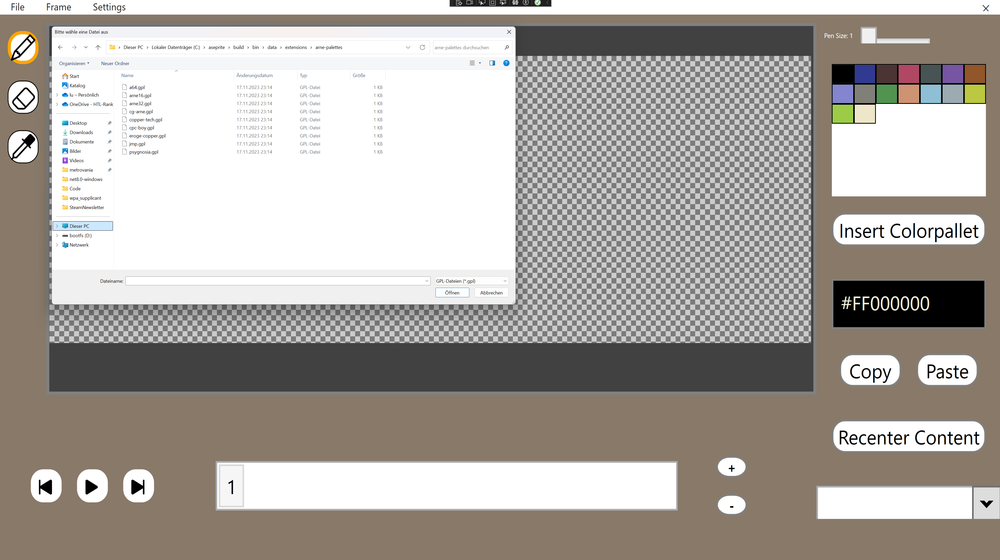
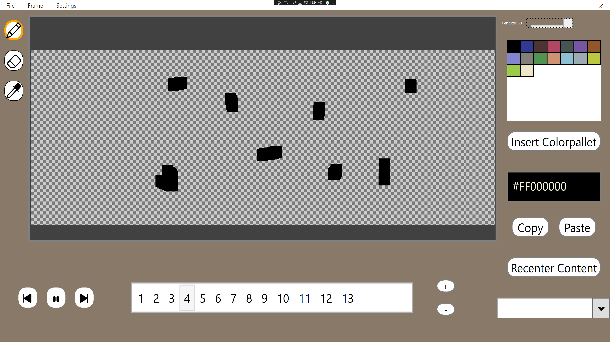
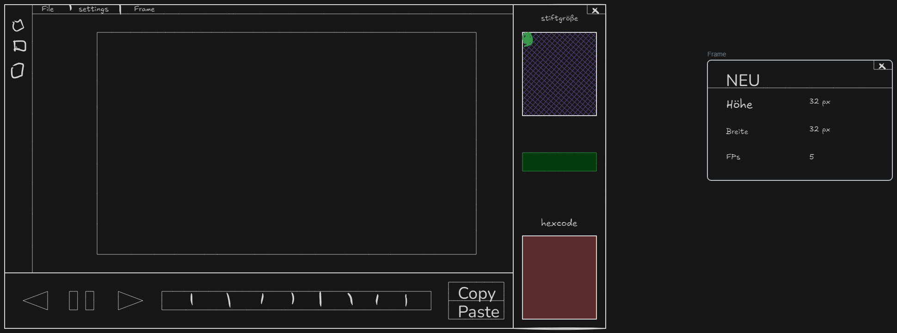
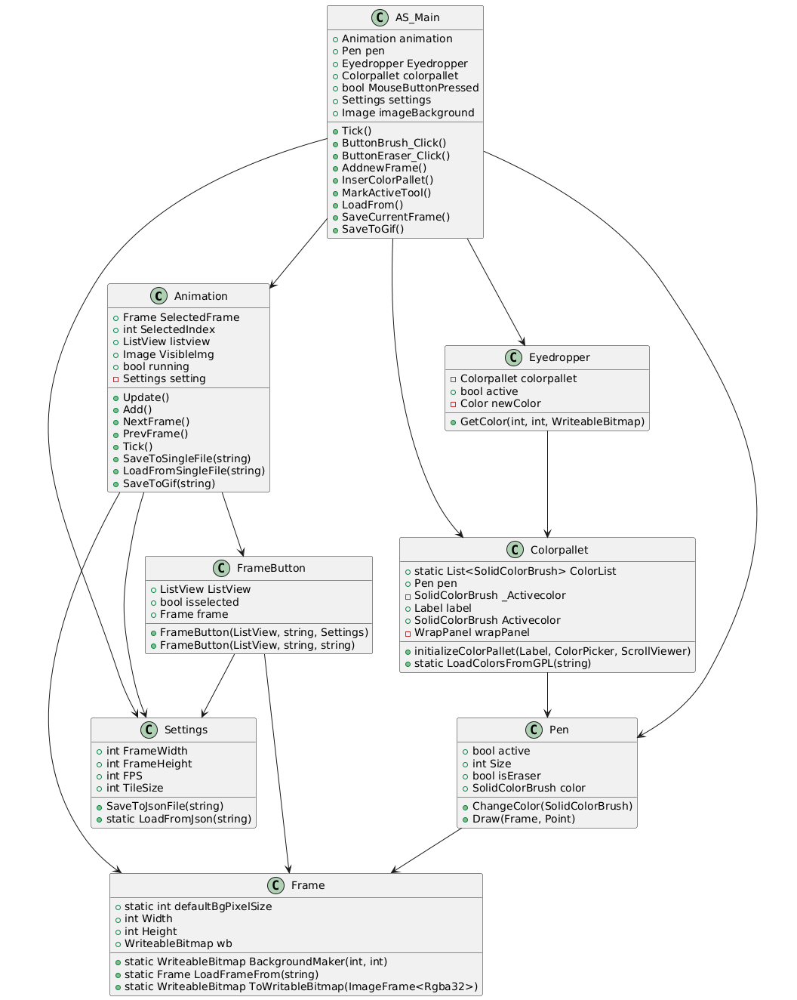

# AS

  

**Projektgruppe:** Dominik Nageler, Luis Kaufmann

  

**Klasse:** 2AHIF

  

**Jahr:** 2024/25

  
  

- Projektitel: AS (Animation Spriter)

- Projetkidee: Pixelart editor mit Funktion Animation zu machen.

  

Betreuer: Lukas Diem, David Bechtold

## Kurzbeschreibung:

  

Programm zum Zeichnen und Animieren von Pixelarts. Man zeichnet auf einer Writeable Bitmap, die dann entweder zum png oder GIF gespeichert werden kann.  

## Must Haves

  

- Pixel Art Editor

- Brush und Eraser

- Farbpallete (Wrappanel)

- Colorpicker HEX

- Camera zoom

- Bleibende Settings

  

## Nice to Have

  

- Animation

- Ladbare Farbpalette

- Copy/Paste Buttons

- Eyedrop tool

- Layers

- Serialisierung von Animation zum GIF

    

## Collage mit mindestens zwei Screenshots






## Relevanter Programmcode:

```c#

  public void ChangePixelColor(Point pos, SolidColorBrush brush, int Size)

  {

      int PixelSize = Size;

  

      Color col = brush.Color;

  

      int x_true = (int)pos.X;

      int y_true = (int)pos.Y;

  

      int stride = wb.BackBufferStride;

  

      wb.Lock();

  

      unsafe

      {

  

          byte* buffer = (byte*)wb.BackBuffer;

  
  
  

          for (int y = y_true; y < y_true + PixelSize; y++)

          {

              for (int x = x_true; x < x_true + PixelSize; x++)

              {

                  byte* pixel = buffer + y * stride + x * 4;

  

                  if (pixel < buffer || pixel > buffer + Height * stride)

                      continue;

                  if (x >= Width)

                      continue;

                  if (y >= Height)

                      continue;

  

  

                  pixel[3] = col.A;

  
  

                  pixel[0] = col.B;

                  pixel[1] = col.G;

                  pixel[2] = col.R;

              }

          }

  

          wb.AddDirtyRect(new Int32Rect(0, 0, Width, Height));

  
  
  

      }

      wb.Unlock();

```

  

## 1 Inhaltsverzeichnis

  

- [Kurzbeschreibung](#kurzbeschreibung)

- [Must Haves](#must-haves)

- [Nice to Have](#nice-to-have)

- [Arbeitsteilung](#arbeitsteilung)

- [Collage mit mindestens zwei Screenshots](#collage-mit-mindestens-zwei-screenshots)

- [Relevanter Programmcode](#relevanter-programmcode)

- [1 Inhaltsverzeichnis](#1-inhaltsverzeichnis)

- [2 Projektzeitplan](#2-projektzeitplan)

- [3 Lastenheft](#3-lastenheft)

  - [3.1. Kurzbeschreibung](#31-kurzbeschreibung)

  - [3.2. Skizzen](#32-skizzen)

  - [3.3. Funktionsumfang](#33-funktionsumfang)

- [4 Pflichtenheft](#4-pflichtenheft)

  - [4.1 Interner Programmaufbau (Programmlogik)](#41-interner-programmaufbau-programmlogik)

  - [4.2 Umsetzungsdetails](#42-umsetzungsdetails)

  - [4.3 Ergebnisse, Interpretation (Tests)](#43-ergebnisse-interpretation-tests)

- [5 Anleitung](#5-anleitung)

  - [5.1 Installationsanleitung](#51-installationsanleitung)

  - [5.2 Bedienungsanleitung](#52-bedienungsanleitung)

- [6 Bekannte Bugs, Probleme](#6-bekannte-bugs-probleme)

- [7 Erweiterungsmöglichkeiten](#7-erweiterungsmöglichkeiten)

  
  
  

## 2 Projektzeitplan

| Datum | Aufgabe| Bearbeiter | Status (%) |
| --- | --- | --- | ---------- |
| 16.05 | TAB Usercontrol  | Dominik    | 60%        |
| 16.05 | Klassen/Frame/RGBA    | Luis       | 70%        |
| 21.05 | GUI Layout/Menü   | Dominik    | 90%        |
| 21.05 | Bitmap fürs zeichnen | Luis       | 100%       |
| 28.05 | Bitmap bezeichenbar machen    | Luis       | 40%        |
| 28.05 | GUI Layout/Menü/Klassen   | Dominik    | 100%       |
| 28.05 | Backround Colors   | Dominik    | 100%       |
| 03.06 | ColorPallet/Colorpicker         | Dominik    | 40%        |
| 03.06 | Bitmap zeichenbar machen        | Luis       | 100%       |
| 04.06 | Colorpallet/Colorpicker   | Dominik    | 100%       |
| 04.06 | Eraser | Luis | 100% |
| 05.06 | Animation | Luis       | 30%        |
| 05.06 | Eyedropper | Dominik    | 100%       |
| 09.06 | Colorpallets laden | Dominik    | 100%       |
| 09.06 | Animation | Luis       | 80%        |
| 09.06 | Settings/Serialisierung | Dominik    | 60%        |
| 10.06 | Settings/Serialisierung | Dominik    | 100%       |
| 10.06 | Animation | Luis       | 100%       |
| 11.06 | Laden/Saven von png | Luis | 100%       |
| 11.06 | GUI Verbesserungen | Dominik    | 100%       |
| 13.06 | Copy/Paste | Dominik | 100%       |
| 13.06 | Save to GIf | Luis | 100%       |
| 14.06 | Load GIF | Luis | 100%       |
| 14.06 | Copy/Paste fix | Dominik    | 100%       |
| 15.06 | Play button gefixed | Dominik    | 100%       |
| 16.06 | Frame optimiert | Luis       | 100%       |
| 16.06 | Border für zeichenbarer Bereich | Dominik    | 100%       |

  

## 3 Lastenheft

  

### 3.1. Kurzbeschreibung

  

Der Benutzer kann Pixelbilder zeichnen und sie in einer Timeline anordnen. Jeder Frame kann bearbeitet werden und am Ende kann die Animation abgespielt oder als GIF gespeichert werden.

  

### 3.2. Skizzen



  
  

### 3.3. Funktionsumfang

  
  

| Pixel Art Editor            | Layout ist Userfriendly und einfach zu benutzen   |
| --------------------------- | --------- |
| Brush                       | Indem  man Linksklick auf das Brushtool und auf den Frame drückt, ändert der Brush den Pixel auf die ausgewählte Farbe um.    |
| Eraser                      | Indem  man Linksklick auf das Erasertool und auf den Frame drückt, ändert der Eraser den Pixel auf Transparents 100%.           |
| Farbpalette                 | Standard Farbpalette mit Basic Farben.                                                                                              |
| Colorpicker                 | NuGet Packet: Extended WPF Toolkits. Hat eine zusätzliche Farbpalette und ein Fenster indem man die RGB daten selbst angeben kann. |
| Kamera zoom                 | Mann kann den Frame beliebig verschieben und raus - hineinzoomen.                                                                   |
| Bleibende Settings          | Die Settings sollen beim Verlassen des Programms gespeichert werden.                                                                |
| Animation                   | Indem man zu einer Listview Frames hinzufügt. Kann man im Programm die Animation abspielen.                                          |
| Ladbare Farbpallete         | Farbpalleten von gpl files laden.                                                                                                   |
| Copy/Paste Buttons          | Copy Button: Kopiert den ausgewählten Frame. Paste Button: Fügt den kopierten Frame in den ausgewählte Frame ein.                   |
| Eyedrop tool                | Wählt die Farbe aus die man auf dem Frame anklickt.                                                                                 |
| Save/Load Animation zum GIF | Mann kann die fertige Animation, die man im Programm erstellt hat, als GIF speichern oder ein fertiges GIF laden.                     |

  
  

## 4 Pflichtenheft

  

### 4.1 Interner Programmaufbau (Programmlogik)



  

### 4.2 Umsetzungsdetails

  

Das ganze ist umgesetzt mit einer Main-Klasse die eine Animations-Klasse enthält. Die Animations-Klasse enthält wiederum eine Liste an Frames. Hauptproblem waren das Speichern der Animationen in GIFs und das wieder zurück laden aus solchen. Gelöst wurde das mit dem NuGet Paket [Image Sharp](https://github.com/SixLabors/ImageSharp).

### 4.3 Ergebnisse, Interpretation (Tests)

  

Laden und Speichern von GIFs ist flüssig sowie von PNGs

Das Zeichnen sowie Animieren ist sehr gut

## 5 Anleitung

  

### 5.1 Installationsanleitung

  
  

1. Auf den Bin Folder drücken

2. As.exe ausführen

  

### 5.2 Bedienungsanleitung

  

1. App Starten

2. In der Menüleiste kannst du Settings auswählen und einstellen wie groß, breit, FPS und Tilesize die App hat.

3. Links oben sind die Tools die man auswählen kann.

4. Wähle das Brush Tool aus und eine beliebige Farbe aus der Farbpallete rechts oben.

5. Wenn du willst kannst du auch deine eigene Farbpallete einfügen indem du sie in einer gpl File hast und auf Insert Colorpallet drückst. Oder du kannst Rechts unten deine Farben mit RGB-Werten selbst auswählen.

6. Zeichne dein Motiv.

7. Nun kannst du rechts unten auf das "+" drücken, um einen weiteren Frame hinzuzufügen.

8. Nun kannst du selber das Motiv neu zeichnen oder es mit den Copy/Paste Buttons in den ausgewählten Frame hineinkopieren.

9. Führe das so lange weiter bis du mit deiner Animation zufrieden bist.

10. Indem du links unten auf den Play Button oder die Leertaste drückst, kannst du sehen wie deine Animation aussehen würde.

11. Nun kannst du in der Menüleiste File auswählen und auf Save as PNG, wenn du nur den ausgewählten Frame speichern willst oder Save as GIF, um die gesamte Animation zu speichern.

12. In File sieht man auch die Optionen Load from PNG und Load from GIF. Mit ihnen kannst du schon fertige Animations/Bilder Laden und selber bearbeiten.

  

## 6 Bekannte Bugs, Probleme

  

Wenn man ein PNG ladet, kann man nur auf dem PNG zeichnen.

  

## 7 Erweiterungsmöglichkeiten

  

Layers hinzufügen

Fill Tool das nur den ausgewählten Bereich füllt.


Repo: https://github.com/iSketchup/AS.git